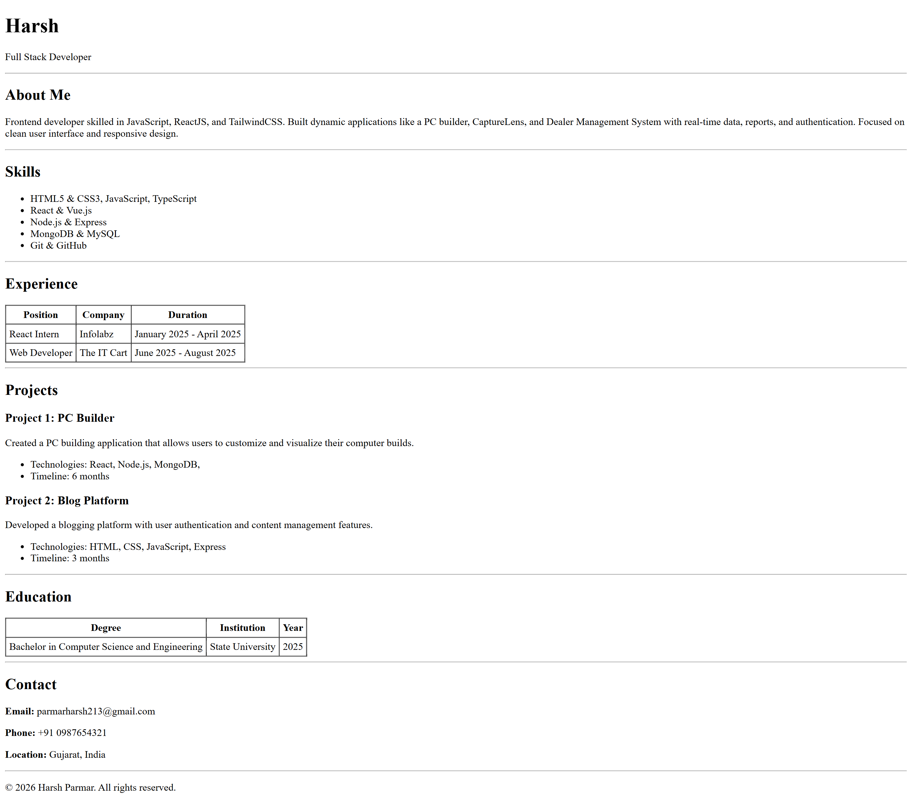

# HTML Resume Assignment

A semantic, single-page resume website built entirely using **pure HTML5**. This project focuses on structure, data organization, and correct tag usage without relying on CSS for styling.

## 🔗 Live Demo
[**View Live Project Here**](https://html-resume-harshparmar.vercel.app/)

## 📝 Project Description
This project replicates a specific resume layout using only HTML elements. The goal was to master document structure using semantic tags, tables for tabular data, and lists for enumeration.

### Key Features:
* **No CSS:** All visual formatting is achieved through standard HTML attributes (e.g., `border="1"`, `
`).
* **Semantic HTML:** Usage of `<header>`, `<section>`, `<footer>`, and heading tags (`<h1>`-`<h3>`) for better accessibility and SEO.
* **Structured Data:**
    * **Tables:** Used for Experience and Education sections to display timelines and details clearly.
    * **Unordered Lists:** Used for Skills and Project technology stacks.
    * **Horizontal Rules:** Used `
` tags to visually separate distinct sections.

## 🛠️ Tech Stack
* **Language:** HTML5
* **Editor:** VS Code (or your preferred editor)
